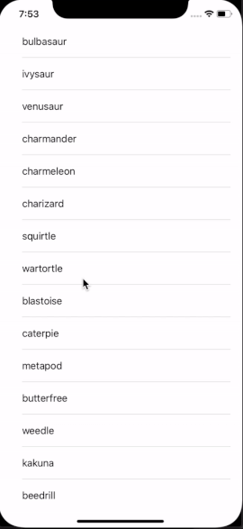

# MOB1.3 Fetching From Pokemon API Exercise
Mobile 1.3 exercise on fetching, parsing and using content from an API.

## About
The purpose of this exercise is to learn about fetching and parsing content from the [Pokemon API](https://pokeapi.co/) then displaying the image of a selected Pokemon in a new view controller. 

### Features
* Home Screen - displays the list of Pokemons in a UITableView with pagination 
* Pokemon Screen - displays the image of the selected Pokemon

### App Walk-through

### Run Locally
Project code can be viewed locally  and run on Xcode's simulator by downloading/cloning this repo.

## Built With
* [Xcode - 11.3.1](https://developer.apple.com/xcode/) - The IDE used
* [Swift - 5.1.4](https://developer.apple.com/swift/) - Programming Language

